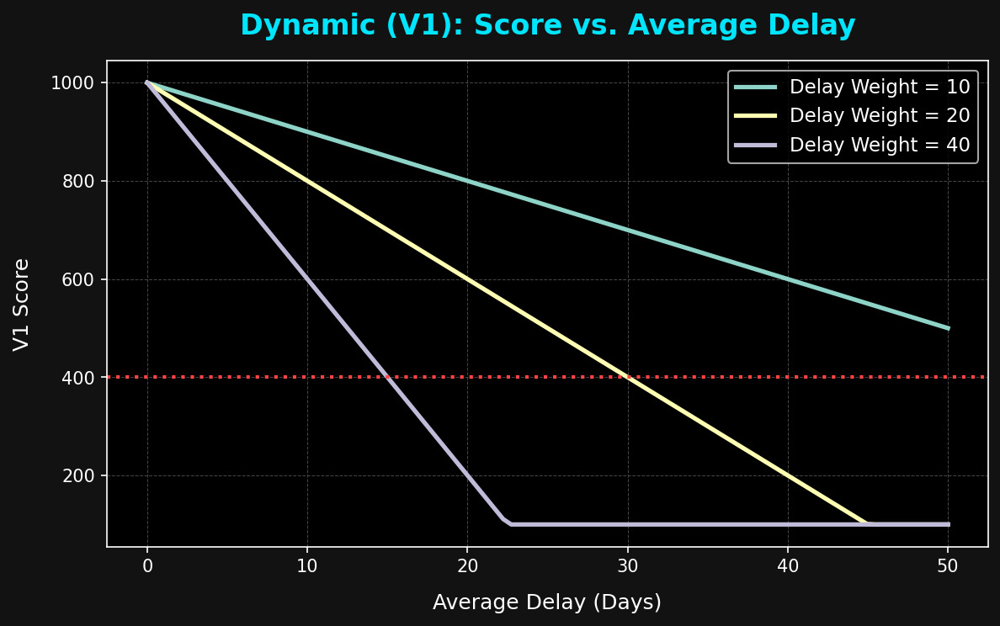
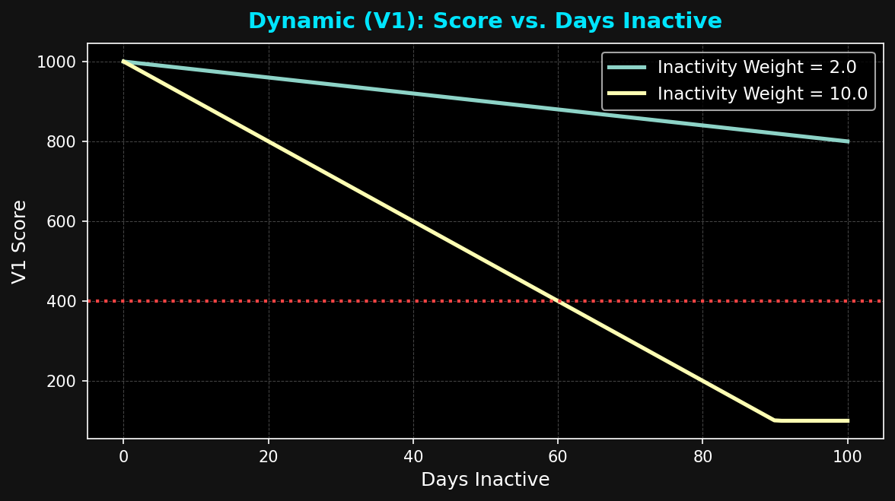
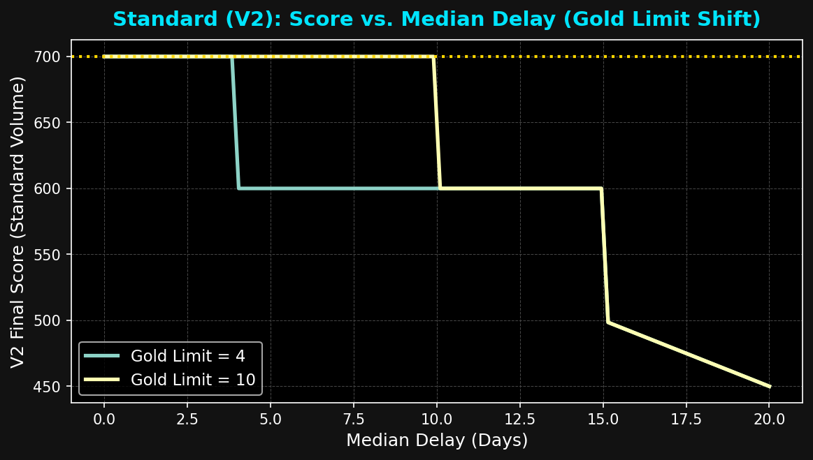
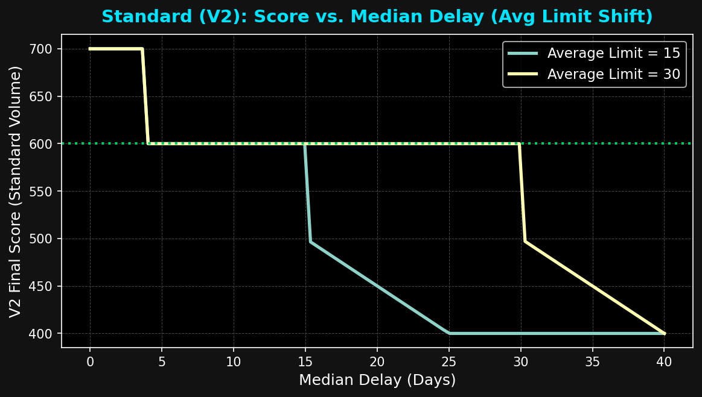
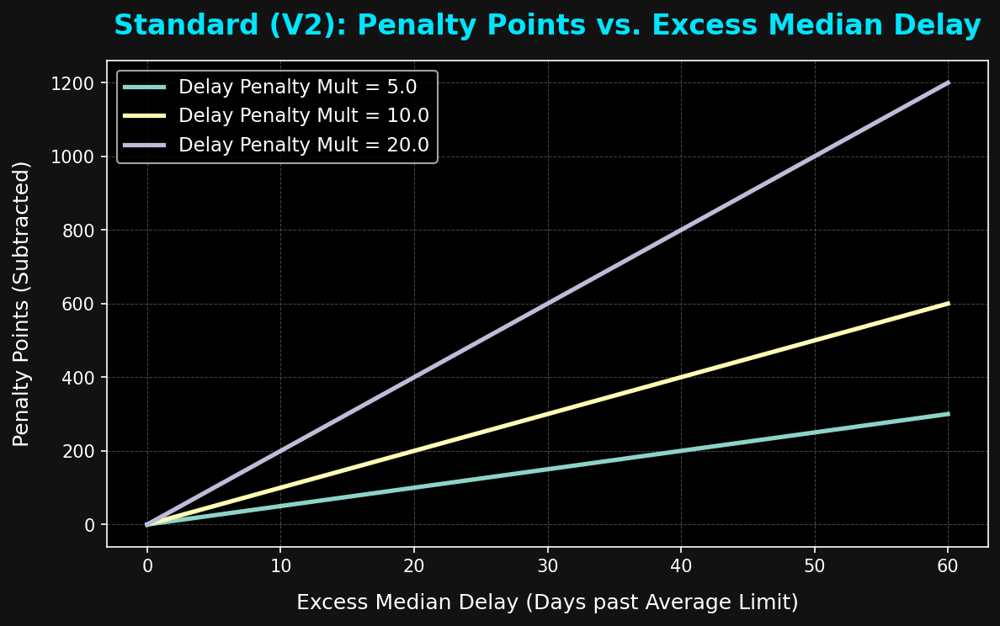
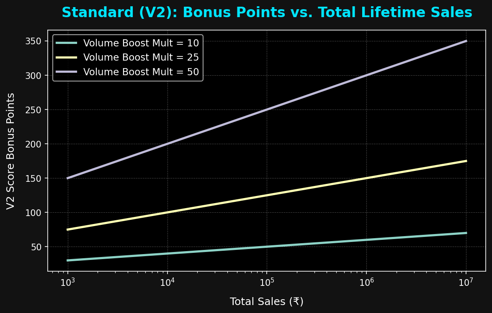
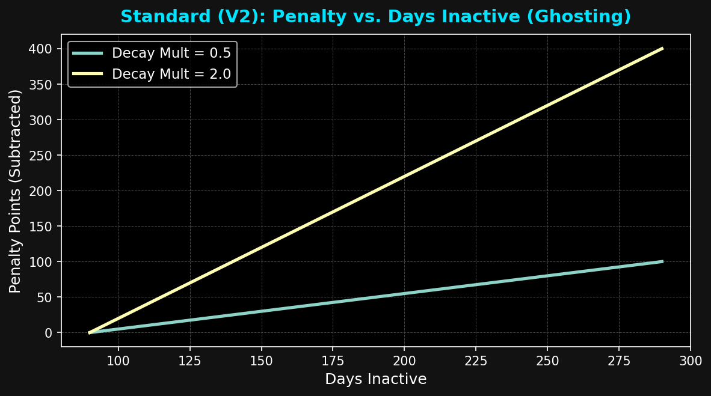

# SBM Traders: Comprehensive CIBIL Scoring Report

This report outlines the significance of the CIBIL scores, providing mathematically proven range-wise classifications to help you make instant business decisions. It also includes a detailed **Business Strategy Tweaking Guide** to help you configure the algorithm for your specific industry.

---

## Part 1: Score Significance & Mathematical Proof (V1)

The ranges for the **Dynamic Score (V1)** are not arbitrary. They map directly to standard B2B wholesale behaviors: a 1-week grace period, a 2-week standard delay, a 1-month cashflow choke, and a 1.5+ month severe default. 

Here is the exact mathematical proof for these ranges, assuming a base configuration of `Delay Weight = 20`. Formula: `1000 - (Avg Delay * 20)`

| Range | Classification | Mathematical Proof (Delay Allowed) | Action to Take |
| :--- | :--- | :--- | :--- |
| **850 - 1000** | **Excellent** | **0 to 7.5 Days.** *(150 max penalty / 20 weight = 7.5).* Customers here pay within a 1-week grace period of the due date. | Extend full credit terms. No follow-up needed. |
| **650 - 849** | **Good** | **8 to 17.5 Days.** *(350 max penalty / 20 weight = 17.5).* Customers here are consistently a week or two late. This is a standard B2B practice. | Safe to approve, but monitor if the trend continues downward. |
| **400 - 649** | **Risky (Warning)** | **18 to 30 Days.** *(600 max penalty / 20 weight = 30).* Customers here hold your money for up to a full month, causing cashflow strain. | Restrict credit. Require partial advance payment for new orders. |
| **100 - 399** | **Defaulter / Ghost** | **31 to 45+ Days.** *(900 max penalty / 20 weight = 45).* Severe, unacceptable delays.  **Ghost Proof:** *900 / 2 (Inactivity Weight) = 450 days.* Customers who haven't ordered in over a year also bleed down to this tier. | **STOP SUPPLY**. Collect pending dues immediately before doing further business. |

---

## Part 2: Score Significance & Deep Math Breakdown (V2)

The **Standard Score (V2)** is designed to mimic a traditional credit score. It permanently remembers a customer's **Lifetime Median Delay** and heavily rewards their **Lifetime Monetary Volume**. 

### The Components of the V2 Formula
To understand the ranges, you must understand the 3 puzzle pieces that are added together:
1. **The Floor Base:** Every customer starts with exactly **300 points**.
2. **The Class Bonus:** You get a huge bonus depending on your median delay:
   * **≤ 4 Days (Gold):** +300 Points
   * **5 to 15 Days (Average):** +200 Points
   * **> 15 Days:** Severe Penalty. Formula: `100 - (Excess Days * 10)`. (e.g., if you are 20 days late, excess is 5. Penalty = `100 - (5 * 10) = +50`).
3. **The Volume Boost:** Rewarding total money spent via Log10 (math that curves massive numbers down to reasonable boosts):
   * **₹10,000 Total Sales:** `Log10(10000) * 25` = **+100 Points**
   * **₹1,000,000 Total Sales:** `Log10(1000000) * 25` = **+150 Points**

### V2 Ranges Explained Through Customer Profiles

| Range | Classification | How the Math Gets You Here | Action to Take |
| :--- | :--- | :--- | :--- |
| **750+** | **VIP Whale** | **Profile:** The Millionaire Fast-Payer. *(Base 300 + Class 300 + Vol 150 = 750).* It is mathematically impossible to reach this tier unless you have spent over ₹1,000,000 and consistently pay within 4 days. | Offer premium discounts, priority dispatch, and highly flexible credit terms. |
| **600 - 749** | **Gold Class** | **Profile:** The Reliable Regular. *(Base 300 + Class 300 + Vol 100 = 700).* A standard customer who buys ₹10k-₹100k, but secures the Gold Class Bonus (+300) by keeping their median delay under 4 days. | Extend standard credit terms. Trustworthy for large orders. |
| **450 - 599** | **Average Class** | **Profile:** The Typical Trader. *(Base 300 + Class 200 + Vol 100 = 600).* A standard customer who pays between 5 and 15 days late. They miss the Gold Bonus, securing only the +200 Average Bonus. | Standard monitoring. Follow up on the due date. |
| **300 - 449** | **Chronic Defaulter** | **Profile:** The Money Holder. *(Base 300 + Class 40 [Penalty] + Vol 100 = 440).* The moment their median delay hits 21 days, the Class Bonus turns into a severe mathematical penalty, ripping a standard customer down to the 300 floor. | Do business on a **cash/advance-only** basis. Do not offer credit. |

---

## Part 3: Comprehensive Parameter Tweaking Guide (Before & After)

The true power of this system is that it bends to your specific industry. If you tweak the parameters, the mathematical definition of the ranges completely shifts. Here is a concrete, bulletproof breakdown of exactly how every single parameter shifts the classification zones, complete with visual graphs.

### 1. Dynamic Score (V1): Changing `Delay Weight` from 20 to 40
**Goal:** "I am cash-strapped and need to ruthlessly enforce strict payment deadlines."

**How this shifts the V1 Ranges:**
* **Before the tweak (Weight = 20):** Excellent (850 - 1000): Customers can be 0 to 7.5 days late.
* **After the tweak (Weight = 40):** Excellent (850 - 1000): Customers can only be **0 to 3.7 days late**.
* **The Result:** The grace period is slashed in half. Customers who were previously classified as "Good" are now mathematically branded as severe Defaulters.

### 2. Dynamic Score (V1): Changing `Inactivity Weight` from 2 to 10
**Goal:** "I only care about active buyers. If a customer hasn't bought from me in a few months, I want them immediately flagged as a Ghost."

**How this shifts a customer who hasn't bought in 60 days:**
* **Before the tweak (Weight = 2):** Penalty is 120 points. Score drops to **880 (Excellent)**.
* **After the tweak (Weight = 10):** Penalty is 600 points. Score crashes to **400 (Defaulter / Ghost)**.
* **The Result:** The system aggressively filters your dashboard, ensuring only active buyers stay in the green zones.

### 3. Standard Score (V2): Changing `Gold Limit` from 4 to 10 days
**Goal:** "My premium customers usually take a week to clear their invoices. I want them to have Gold status."

**How this shifts a customer with a median delay of 7 days:**
* **Before the tweak (Limit = 4):** They miss the +300 Gold Bonus. They fall into the **Average Class** (+200).
* **After the tweak (Limit = 10):** Because 7 is now under the threshold, they secure the full +300 bonus and sit safely in the **Gold Class**.
* **The Result:** This expands the definition of a "VIP/Gold" payer.

### 4. Standard Score (V2): Changing `Average Limit` from 15 to 30 days
**Goal:** "My buyers are seasonal traders. I need the system to be lenient and accept 30-day payment cycles as perfectly normal."

**How this shifts classifications for a customer paying 25 days late:**
* **Before the tweak (Limit = 15):** The customer is a **Defaulter (Score: 400)**. 
  * *The Math:* Since 25 is past the 15-day limit, the +200 bonus is lost. Excess is 10 days. Their Class Bonus becomes `100 - (10 * 10) = 0`. Base is 300 + 0 Bonus + 100 Volume = 400.
* **After the tweak (Limit = 30):** The customer is securely in the **Average Class (Score: 600)**.
* **The Result:** You shift the entire definition of a "Defaulter" back by 15 days.

### 5. Standard Score (V2): Changing `Delay Penalty Mult` from 10 to 25
**Goal:** "I want to permanently punish customers who chronically sit past my due dates."

**How this shifts a customer who pays 21 days late (6 days past the default 15 limit):**
* **Before the tweak (Mult = 10):** Their Class Bonus drops to `100 - (6 * 10) = 40`. With a standard +100 volume boost, their final score is **440 (Chronic Defaulter)**.
* **After the tweak (Mult = 25):** Their Class Bonus plummets to `100 - (6 * 25) = -50`. Their final score drops to **350**. 
* **The Result:** The punishment curve becomes a cliff.

### 6. Standard Score (V2): Changing `Volume Boost Mult` from 25 to 50
**Goal:** "I want to pamper my massive Millionaire Whales unconditionally and forgive them if they pay late."

**How this shifts a Whale (₹1,000,000 Lifetime Sales, Log10 = 6):**
* **Before the tweak (Mult = 25):** If they pay 25 days late, their Class Bonus becomes 0. Their score becomes `300 Base + 0 Class + 150 Volume = 450` (**Bottom of the Average Class, on the brink of Defaulter**).
* **After the tweak (Mult = 50):** Volume Boost doubles to +300! With the exact same delay, score becomes `300 Base + 0 Class + 300 Volume = 600` (**Safely in Gold Class**).
* **The Result:** The Volume Boost acts as a mathematical shield.

### 7. Standard Score (V2): Changing `Decay Penalty Mult` from 0.5 to 2.0
**Goal:** "If a standard customer stops doing business with me, I want their lifetime score wiped out within a few months."

**How this shifts a customer who hasn't bought in 190 days:**
* **Before the tweak (Mult = 0.5):** Penalty is 50 points. They remain in their respective class.
* **After the tweak (Mult = 2.0):** Penalty is 200 points. This massive bleed throws them into the Defaulter tier.
* **The Result:** The V2 score becomes a "use it or lose it" system.

---

## Part 4: Guidelines on New Safe Scores when Limits Shift

When you change the **Gold Limit** and the **Average Limit** in V2, you are fundamentally redefining what constitutes "Safe" behavior. Here is how to map those tweaks to your actual business guidelines.

### Guideline 1: The Gold Limit Shift
* **What it does:** The Gold Limit dictates the maximum median delay allowed to receive the +300 Gold Bonus (the only way to reach the 750+ VIP Whale tier).
* **If you decrease it (e.g., to 2 Days):** You make the Gold Class extremely elite. You are telling the system: *"Only customers who pay almost immediately on delivery are safe for high-volume credit."* The safe zone for top-tier credit violently shrinks. Use this if your goods are highly liquid (like electronics or bullion) and you cannot afford money to be stuck in the market.
* **If you increase it (e.g., to 10 Days):** You expand the Gold safe zone. You are telling the system: *"A week-long delay is perfectly safe and normal."* Use this if your competitors offer 7-10 day credit terms and you want your system to recognize these customers as "Excellent" rather than punishing them.

### Guideline 2: The Average Limit Shift
* **What it does:** The Average Limit dictates the maximum median delay allowed to receive the +200 Average Bonus (keeping the score at a safe 500-600). Anything past this limit triggers the brutal Delay Penalty multiplier.
* **If you decrease it (e.g., to 7 Days):** The "Average Class" safe zone is cut in half. Anyone taking 2 weeks to pay drops into the Defaulter tier. Use this if you are actively tightening your credit terms across the board and want the dashboard to immediately flag historically "average" customers who haven't adapted to your new strict rules.
* **If you increase it (e.g., to 30 Days):** You drastically expand the safe zone. A 30-day payer safely sits in the Average tier (600 score) instead of crashing to the 300 floor. Use this if your standard invoice terms are "Net 30". **Crucial Rule:** Your Average Limit should always perfectly match your official invoice terms!

---

## Part 5: Detailed Guide - How to Use Different Parameters Effectively

To get the most out of your CIBIL engine, you must use the parameters strategically. Here is a master guide on how to tune each knob effectively based on your specific business environment.

### 1. Delay Weight (V1)
* **What you are tuning:** Your tolerance for short-term cashflow bottlenecks.
* **How to use it effectively:**
  * **Turn it UP (e.g., 40.0):** When your own cash reserves are low, or market interest rates are high. You need your money fast, and you want the dashboard to aggressively flag anyone who is even a few days late on recent invoices so you can halt their supply.
  * **Turn it DOWN (e.g., 10.0):** When you have high cash reserves and are trying to aggressively capture market share by offering flexible, relaxed credit terms.

### 2. Inactivity Weight (V1)
* **What you are tuning:** Your focus on customer retention and recurring revenue.
* **How to use it effectively:**
  * **Turn it UP (e.g., 10.0):** If you sell fast-moving consumer goods (FMCG) where customers should be buying weekly. A high weight instantly exposes customers who have stopped buying from you (Ghosts).
  * **Turn it DOWN (e.g., 1.0):** If you sell high-ticket, durable goods where customers naturally only buy once every 6 months.

### 3. Volume Boost Mult (V2)
* **What you are tuning:** How much you let your highest-paying clients get away with.
* **How to use it effectively:**
  * **Turn it UP (e.g., 50.0):** If your top 5% of clients generate 80% of your revenue. You want this multiplier as high as possible so their scores remain bulletproof in the 700s/800s, ensuring your sales team never accidentally denies them credit over a minor 10-day delay.
  * **Turn it DOWN (e.g., 10.0):** If your revenue is evenly distributed across hundreds of small buyers. You want everyone judged equally on their payment speed, rather than letting rich buyers mathematically bully their way into good scores.

### 4. Delay Penalty Mult (V2)
* **What you are tuning:** Your long-term memory for bad actors.
* **How to use it effectively:**
  * **Turn it UP (e.g., 25.0):** If your margins are razor-thin. A high multiplier turns the penalty into a cliff. One bad month of late payments will completely obliterate a customer's lifetime score, ensuring you don't trust them again for years.
  * **Turn it DOWN (e.g., 5.0):** If you are operating in a tough macroeconomic environment where everyone is struggling. A low penalty allows historically good customers to recover their score quickly after going through a temporary rough patch.

### 5. Decay Penalty Mult (V2)
* **What you are tuning:** The "Use it or Lose it" factor for lifetime trust.
* **How to use it effectively:**
  * **Turn it UP (e.g., 2.0):** To keep your Top Customer leaderboard fresh. If a Platinum customer stops buying from you for 6 months, a high decay multiplier will aggressively wipe out their lifetime score, making room for your new, active buyers.
